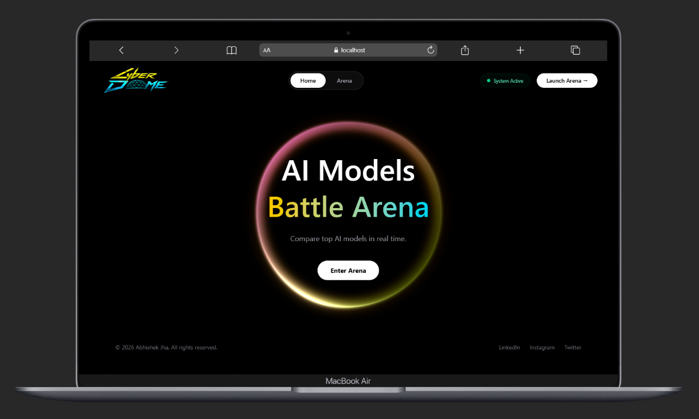

# CyberDome ⚔️

CyberDome is an AI Battle Arena where multiple AI models compete on the same prompt and an AI Judge evaluates their responses to determine the winner.

## Features

- Multi-model AI comparison
- Mistral AI vs Cohere AI
- Gemini-powered evaluation
- Real-time scoring and ranking
- Detailed reasoning for each score
- Modern responsive UI

## Tech Stack

### Frontend
- React
- TypeScript
- Tailwind CSS
- React Router

### Backend
- Node.js
- Express.js
- TypeScript

### AI & Orchestration
- LangGraph
- LangChain
- Gemini 2.5 Flash
- Mistral Small
- Cohere Command R

## Project Structure

```bash
Backend/
├── src/
│   ├── config/
│   │   └── config.ts
│   │
│   ├── services/
│   │   ├── graph.ai.service.ts
│   │   └── models.service.ts
│   │
│   └── app.ts
│
├── server.ts
└── package.json

Frontend/
└── React Application
```

## Installation

### Backend

```bash
cd Backend
npm install
```

### Frontend

```bash
cd Frontend
npm install
```

## Environment Variables

Create a `.env` file inside Backend:

```env
GOOGLE_API_KEY=your_google_api_key
MISTRAL_API_KEY=your_mistral_api_key
COHERE_API_KEY=your_cohere_api_key
```

## Run Backend

```bash
npm run dev
```

## Run Frontend

```bash
npm run dev
```

## How It Works

1. User enters a prompt.
2. Mistral AI generates a response.
3. Cohere AI generates a response.
4. Gemini evaluates both responses.
5. Scores are assigned.
6. Winner is selected.
7. Results are displayed in the Arena.

---
## ScreenShot



---

## Demo Link


---

## Author

**Abhishek Jha**

MERN Stack Developer | AI Enthusiast
